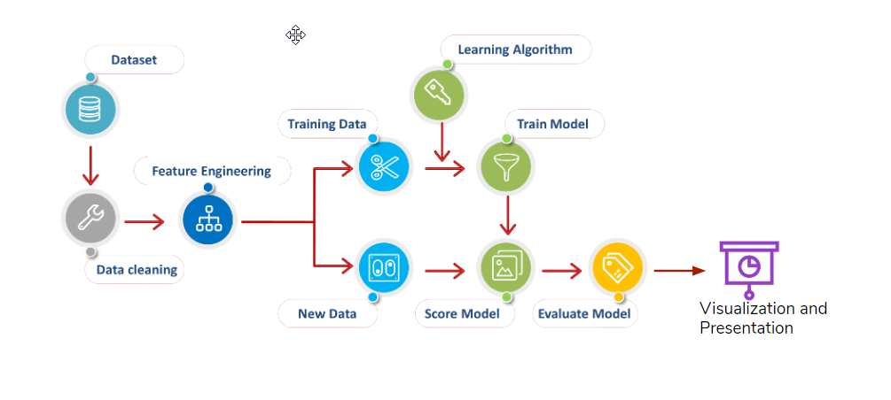
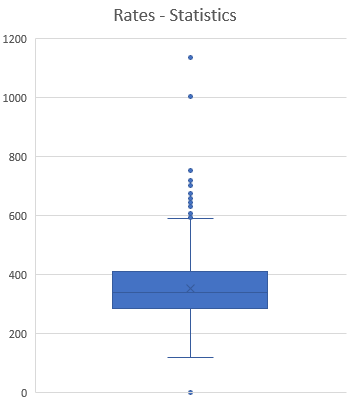
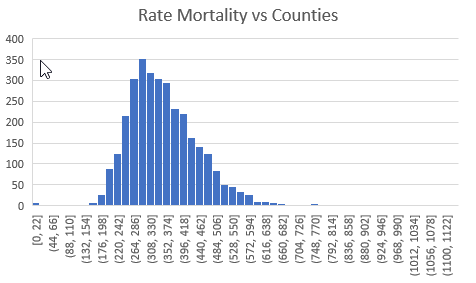
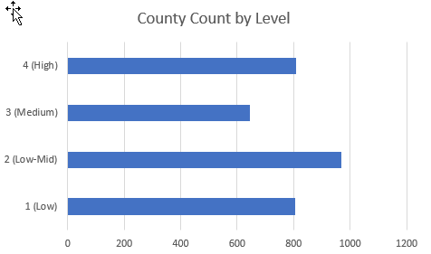
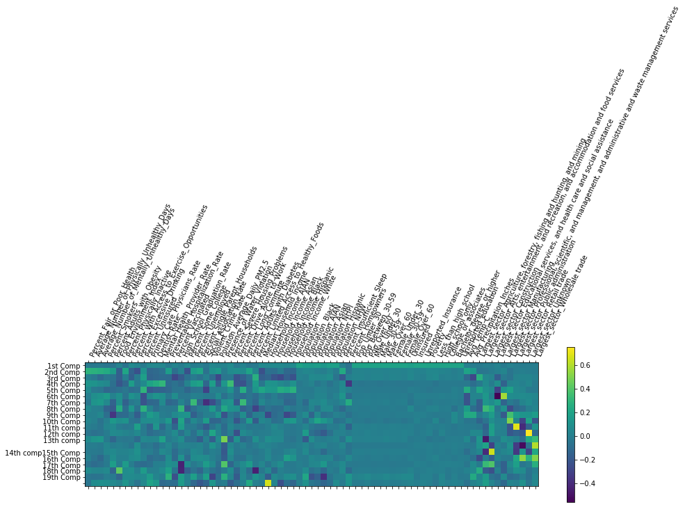
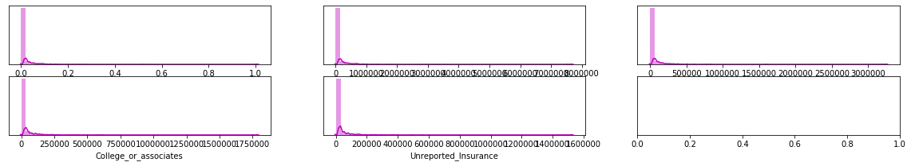
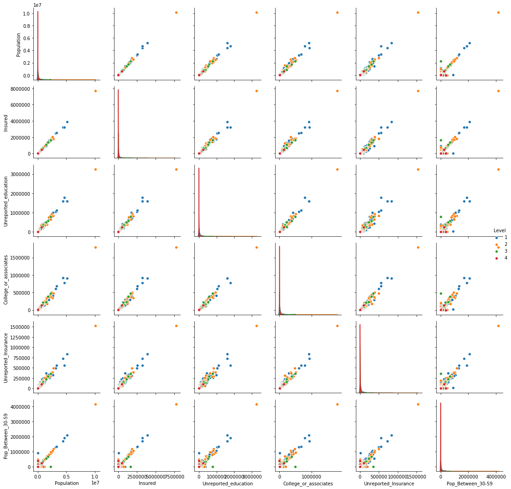
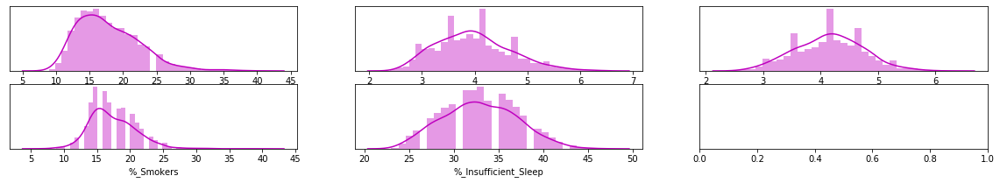
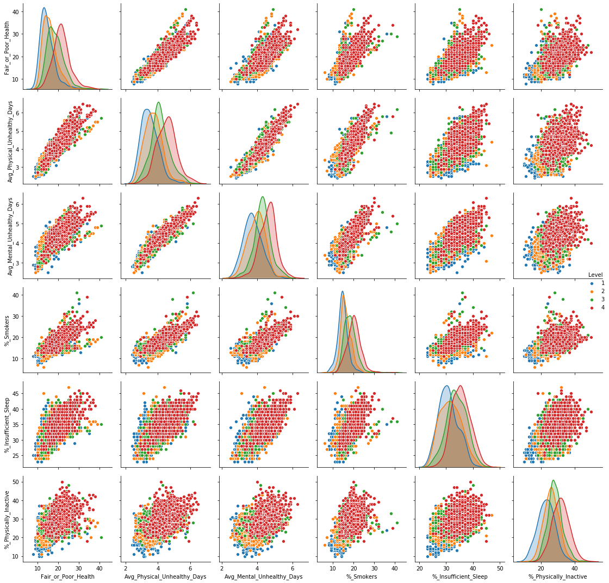

# Heart Disease By County ML

# Project Outline

## Topic
This project focuses on Heart Disease in the United States. Specifically, it attempts to predict the likelihood of heart disease mortality by county. This project compares different Machine Learning models to see the best fit for the use case and the available datasets. 

We chose this topic because of the following reasons:
- Heart disease remains leading cause of death in US (1 in 3 deaths) and it’s expensive to take care
- Personal interests in heart disease to know how it can impact us and the mitigation
- Wide availability of reliable, sourced data . 

We hope that we may learn some insightful results regarding the disease prevelance and the factors which surround it.

## Questions to Investigate
What factors impacts the heart disease mortality in US, and their significance? 
- Are social economic, environmental, lifestyle, or health measures more impactful?
- Is the identified factor correlation or causation of heart disease mortality ? 

## Source Data
 The majority of our data are from the 'County Health and Rankings Roadmap', a collaboration between the University of Wisconsin and the Robert Woods foundation. The raw data can be found here: https://www.countyhealthrankings.org/explore-health-rankings/rankings-data-documentation. Its original purpose was to rank each county in the United States by the health quality of its residents. For our purposes, the data outlines various health, life-style and environmental metrics by county in the United States. Some examples of these measures includes Adult Smoking Prevelance, Adult Obesity Prevelance, Education Rankings, Excessive Drinking, and others. 

According to the data compilers, it was sourced from various sources, primarily government agencies. 

They are : 
- National Center for Health Statistics - Mortality Files
- Behavioral Risk Factor Surveillance System
- National Center for Health Statistics - Natality files
- United States Diabetes Surveillance System
- USDA Food Environment Atlas, Map the Meal Gap from Feeding America
- Business Analyst, Delorme map data, ESRI, & US Census Tigerline Files
- Fatality Analysis Reporting System
- National Center for HIV/AIDS, Viral Hepatitis, STD, and TB Prevention
- Small Area Health Insurance Estimates
- Area Health Resource File/American Medical Association
- Area Health Resource File/National Provider Identification file
- CMS, National Provider Identification
- Mapping Medicare Disparities Tool
- State-specific sources & EDFacts
- American Community Survey, 5-year estimates
- Bureau of Labor Statistics
- Small Area Income and Poverty Estimates
- County Business Patterns
- Uniform Crime Reporting - FBI
- Environmental Public Health Tracking Network
- Safe Drinking Water Information System
- Comprehensive Housing Affordability Strategy (CHAS) data

In trying to model the georgraphic presence of heart disease, we are analyzing several features. These include:

*Full Feature List*:

- %_Fair_or_Poor_Health
- Avg_No._Physically_Unhealthy_Days	
- Avg_No._Mentally_Unhealthy_Days	
- %_Smokers
- %_Adults_Obesity	
- Food_Environment_Index	
- %_Physically_Inactive	
- %_Access_to_Exercise_Opportunities	 
- %_Excessive_Drinking	
- %_Uninsured	
- Primary_Care_Physicians_Rate	
- Dentist_Rate	
- Mental_Health_Provider_Rate	
- Preventable_Hospitalization_Rate	
- %_Vaccinated	
- High_School_Graduation_Rate	
- %_Some_College	
- %_Unemployed	
- %_Single_Parent_Households	
- Social_Association_Rate	
- Violent_Crime_Rate	
- Polution_Average_Daily_PM2.5	
- Presence_of_Water_Violation	
- %_Severe_Housing_Problems	
- %_Drive_Alone_to_Work	
- %_Long_Commute	
- %_Adults_with_Diabetes	
- %_Limited_Access_to_Healthy_Foods
- %_Insufficient_Sleep
- Average_Traffic_Volume_per_Meter_of_Major_Roadways
- %_Homeowners
- %_Severe_Housing_Cost_Burden
- %_Children_in_Poverty
- Teen_Birth_Rate
- Uninsured
- Insured
- Unreported_Insurance
- Poverty
- Less_than_high_school
- High_school_only
- College_or_associates
- Bachelor_degree_or_higher
- Unreported_education

 Additionally, we augmented to these data by including county population, population split by age/gender and median household income. 
 
- Median_Household_Income
- Household_Income_AIAN
- Household_Income_Asian
- Household_Income_Black
- Household_Income_Hispanic
- Household_Income_White 
- Population
- Population_Black
- Population_AIAN
- Population_Asian
- Population_NHPI
- Population_Hispanic
- Population_NHW
- Pop_Under_30
- Pop_Between_30-59
- Pop_Over_60
- Male_Under_30
- Male_30-59
- Male_Over_60
- Female_Under_30
- Female_30-59
- Female_Over_60
 
 These data were sourced from the USDA Economic Research Service.

 Also we augmented data with Largest job sector in each county, Temperature and Percipatation 

- Largest_sector
- Avg_Temperature
- Avg_Temp_C
- Avg_Precipitation_Inches

## Database Design
---

We utilized SQLite as our database engine. We chose SQLite because of its local storage, allowing us to more easily manipualte the data without setting up a more formal engine.

For conceptual purposes, our team developed an Entity Relationship Diagram to clearly demonstrate how our source data relate to one another. This diagram can be seen here:

The two primary keys which bind all the source data together are  State Code, a two letter abbreviation for each state, and County Name. 

- Parent Table "State" holds Name, Code. 
- Second Table "Heart_Disease_Mortality_State_Counties" holds mortality rate per 100,000, which was then classified into four levels: 1, 2, 3, 4.
- Third table "Features_State_Counties" holds most of the features.
- Fourth table "Population_State_Counties" holds population data. 

## Technology Reference
---

[technology.md](technology.md)

1. Excel (Data Extraction & Data Validation)
2. Jupyter Notebook (IDE) (dependency list in the file [requirements.txt](requirements.txt) 
3. Python 3 (Data Analysis and ML)
4. Sqlite (Data Storage)
5. Googleslide (Presentation)
6. Tableau (Visualization)

## Workflow
---

## Machine Learing 
---

### Pre-processing
---

The data stored in SQLite is loaded into a jupyter notebook after connecting the database. The dataframe is read-in using SQL given it is the base language of the data engine.

Next, some data scrubbing takes place. This includes investigating using boxplots and removing outliers if deemed necessary (Average_Traffic_Volume) for instance, searching and removing null values or replacing with zeros.

Next, target values and feature dataframes are established. In this project, mortality "level" is the target value. Each county is assigned a heart disease mortality level, caluclated using quartiles. Meaning the counties with the lowest levels of heart disease mortality are assigned a level of 1, and the highest quartile a level of four. Our model will attempt to predict which level a county belongs to using a testing dataset after being trained.

**Target data (statistics)**

**Target Histogram (Distribution)**

**Target Categories**

### Splitting in training and testing sets
---

The overall dataset was transformed into testing and training sets using train_test_split module from SciKitLearn. This was done for both the x variables (featues) and y-target variable (level). Additionally, each testing and training set was scaled for easier computing and uniformity utilizing StandardScaler. This module alters the data so that it has a mean of 0 and a standard deviation of 1. 

### Models
---

Our team tested a number of machine learning methods in an attempt to find the most effective in predicitng the level of heart disease mortality per county. In evaluating the models, we used accuracy and recall as a base metric to compare the models to eachother. All of our models were analyzed via SciKitLearn. 

Based on the Exploratory Data Ananlysis we decided on a Machine Learning model using a Random Forest Classisifer to make the prediction. Additionally, our model will rank the various features in the dataset to relate their impact on heart disease.

Below is a link to the decision tree's used by our Random Forest Classifier:

[https://heart-disease-by-county.surge.sh/tree.html](https://heart-disease-by-county.surge.sh/tree.html)

We also tried to do dimension reduction using PCA, by plotting cummulative explained variance ration and number of components we arrived at optimum number of components 20 which covers 80% of variance. 

This figure shows the PCA with different feature rankings/contribution 

. 

Images below show the density plot and distribution for top 6 features from Component 1

The PCA dimension reduction was subsequently fed into the Machine Learning Random Forest Classifier Model, which returned an accuracy of close to 49%.

## Notebooks
---

**Week 1**: Data Extraction, Data Storage

[HeartDisease_ML_Week1.ipynb](HeartDisease_ML_Week1.ipynb)

**Week 2**: Exploratory, Data Validation, Data Warngling, Data Analysis with MLs

[HeartDisease_ML_Week2.ipynb](HeartDisease_ML_Week2.ipynb)

**Week 3 and Week 4**: Final ML, Explore Data for Visualization (Dashboard)

[HeartDisease_ML_Week3.ipynb](HeartDisease_ML_Week3.ipynb)

## Limitation - Data
---
Limitation of the dataset collected and used for the machine learning model

1. Data is limited by publicly available data based on survey questions and social features

2. No available data on unique county characteristics such as local food consumption habits, medical records, or family characteristics

## Storyboard
---

Independent users may interact with the data set via Tableau public here:

Link to the storyboard: [https://public.tableau.com/profile/matt.root#!/vizhome/Heart_Disease_Mortality/HeartDiseaseMortality](https://public.tableau.com/profile/matt.root#!/vizhome/Heart_Disease_Mortality/HeartDiseaseMortality)

This Storyboard includes a number of visualizations that highlight the main findings of the machine learning model and our team's analysis. They include:

1. An interactive heat map where a user can select a feature that heavily impacts heart disease mortality and be shown where in the country the feature is prevelant.

2. A bar chart highlighting the 5 most determinant features in the model.

3. A heat chart ranking feature importance.

A thorough dashboard description can be found here: [Dashboard_Description.md](Dashboard_Description.md)

## Findings
---
The top factors/features identified by our seems to be aligned with some of the Reaserch and papers published in the medical field and other research field. Please find some sample findings we have collected

- Features identified by our model relating to heart disease are in line with other studies 
- A Canadian study showed that income is strongly and independently associated with heart disease. It showed that low income residents are 52% more likely to have heart disease.  The study also showed that lower income residents also have higher prevalence in conventional heart disease factors such as smoking habit, high blood pressure, and physical inactivity. 
- CDC study showed that smoking has a causation effect on heart disease. One of every four deaths from heart disease is caused by smoking. Smoking causes a number of physiological damage such as raising triglycerides, lowering good cholesterol, causing blood to be more prone to clotting, and so on, all of which lead to higher risks in heart disease.
- Our model result showed self-reported “% of unhealthy days”, “% of mentally unhealthy days”, and “poor health” as leading features in the prediction model.  This is in line with another study published by CDC which established “patients’ perception of their general physical and mental health status” as an important measure of cardiovascular disease.  The prevalence of self-reported fair/poor health also decreased with higher education and income. 
- Another key feature shown in our model is average temperature.  CDC reported that heat waves have long been a threat to public health.  In terms of heart disease, heat waves have a causation effect causing many deaths in cardiovascular disease. 

### References
---
Links for the references we collected to justify our findings and conclusion

- Lemstra, M., Rogers, M., & Moraros, J. (2015). Income and heart disease: Neglected risk factor. Canadian family physician Medecin de famille canadien, 61(8), 698–704.
- Centers for Disease Control and Prevention (2020). Smoking and heart disease and stroke. Retrieved from https://docs.google.com/presentation/d/1qPEiTcT5hdARe0zSVPUw2gLa-lvXnCOFxAzWB8XS0uM/edit#slide=id.g8943ee270c_4_321 on June 19, 2020. 
- Odom EC, Fang J, Zack M, Moore L, Loustalot F. Associations Between Cardiovascular Health and Health-Related Quality of Life, Behavioral Risk Factor Surveillance System, 2013. Prev Chronic Dis 2016;13:160073. DOI: http://dx.doi.org/10.5888/pcd13.160073
- Centers for Disease Control and Prevention (2019). Temperature Extremes. Retrieved from  https://www.cdc.gov/climateandhealth/effects/temperature_extremes.htm

## Conclusion:

We can conclude that all the different vectors of the features like Social Economic, Environment, Lifestyle, Health plays a role in the Heart Disease mortality. The top 5 feature Median Household Income(Social Economic), Smoking (Lifestyle), Average Temperature (Environment), Physical Unhealthy/Poor Health (Health) confirms that. 
   
Correlation and Causation: Using the research paper and other findings we can say Lifestyle, Environment and Health could be causation while Social Economic could be correlated factor. Though the model doesn't concretely justify the correlation and causation  of the factors/features which affect the Heart Disease Mortality rate .

## Google Slides
---

- Link to presentation: https://docs.google.com/presentation/d/1qPEiTcT5hdARe0zSVPUw2gLa-lvXnCOFxAzWB8XS0uM/edit?usp=sharing

