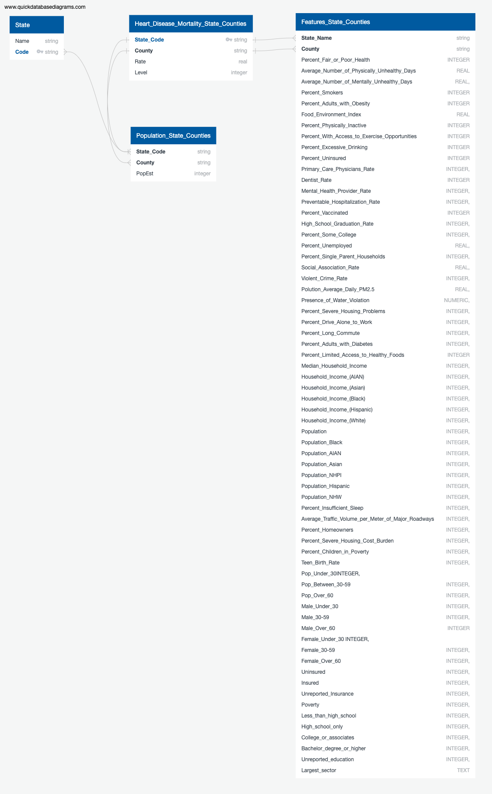

# Technologies Used
## Data Cleaning and Analysis
Excel was used for initial, but brief, data cleaning. This was mainly done because the needed tranformations for Excel specific, namely unmerging cells. After this initial cleaning, we converterd the files to csv files before reading into Notebooks. Pandas will be used to clean the data and perform an exploratory analysis within Jupyter Notebooks. Further analysis will be completed using Python, specifially SQLite was imported into our Jupyter Notebooks to utilize its coding to final data transformation.

## Database Storage
Our project utilizes SQLite as our relation database and query system. This is because our data is neither large nor do we need our data consumers to necessarily view it. Our team created an ERD to visualize the specific tables we are working with: 

## Machine Learning
We will be using SciKitLearn as our machine learning library. Specifically, we will be utilizing a Random Forest Model for classification and feature ranking. As of 5/31, our model obtained an overall accuracy of 59%.

## Dashboard
Given our data is in xls form, Tableau is the best option for our dashboard. Tableau works well with maps and will be user friendly when trying to highlight the sverity of heart disease in particular counties.
